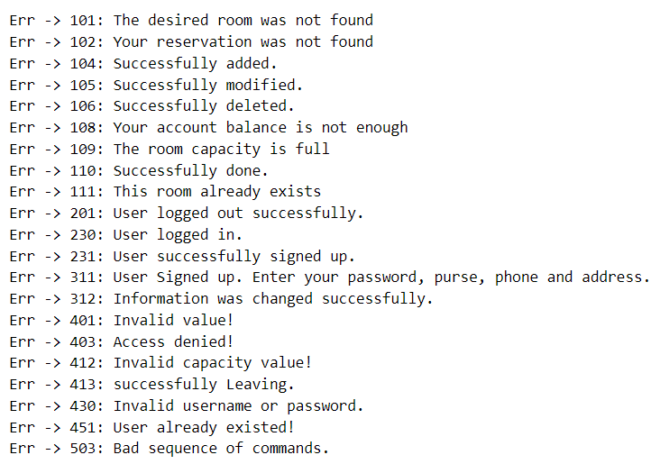

# CN-CA1🌐
## Computer Network CA1. 📡

### Amir-Hossein Shahgholi (SID: 810199441)🎓

### Erfan-Soleymani (SID: 810199439)🎓
 

- [Setup Server](#Setup-server)
- [Client Side](#Client-side)
- [List of Errors](#List-of-Errors)
- [License](#license)

For generating `client.out` and `server.out` files run this command: 
<pre>
make
</pre>

## Setup-server 
then you have to run server side first.
<pre>
./server.out
</pre>
Then you should set time with command `setTime`.
 Ex. (Pay attention to the date format)
<pre>
setTime 27-02-2023
</pre>

Then server will start.
  

## Client-side 
You can run client file in another terminal
<pre>
./client.out
</pre>

Now you connect to the server. 
Options:  
`signup`: Ex.
<pre>
signup "Username"
</pre>
`signin`: Ex.
<pre>
signin "Username" "Password"
</pre>

If you signin or signup successfully you will see [Menu of Commands](#Commands-menu).

## Commands-menu
0. Logout
1. View user information
2. view all users
3. View rooms information
4. Booking
5. Canceling
6. pass day
7. Edit information
8. Leaving room
9. Rooms

## List-of-Errors

بخش اصلی سرور تابع main هست که با استفاده از کتابخانه ی json ابتدا تمامی فایل های json را میخواند و در مدل های اصلی ذخیره میکند. 
ولیدیت کردن تاریخ ورودی هم با استفاده از regex صورت میگیرد تا کاربر تاریخ را به درستی وارد کند.سرور با استفاده از select ، کلاینت های جدید را قبول میکند و پیام های کلاینت ها را سریالایز میکند و به بخش هندل کامند ها میفرستد که کامند هر کلاینت هندل شود.
مدل های اصلی بخش سرور User, Room, Reservator , UserStatus
هستند.
مدل یوزر و رزرویتور و رووم برای اطلاعات اصلی فایل های جیسون استفاده میشود و مدل یوزر استاتوس برای استیت حال هر کلاینت استفاده میشود. هر کلاینت وقتی به سرور متصل میشود یک fd به آن تعلق میگیرد که در یوزر استاتوس ذخیره میشود.
برای کامند های چند بخشی یک استیت بولین در یوزر استاتوس استفاده میشود که مشخص کند کلاینت در بخش کدام دستور خاص است و توقع چه کامند هایی را از طرف کلاینت داریم و در صورتی که کامند اشتباهی وارد میشود که هماهنگی با استیت ندارد کلاینت ارور مشاهده میکند و کامل به استیت منو  میرود کلاینت. 
بخش فرستادن ارور هم با استفاده از تابع raise_error صورت میگیرد که آیدی کلاینت دریافت میشود و از روی مپ ارور ها ارور مناسب برای کاربر فرستاده میشود.
تابع های فرستادن اطلاعات با چک کردن ادمین بودن کلاینت و با استفاده از مدل های موجود پیام مناسب را میسازد و به کاربر متناظر ارسال میکند. دستور logout هم ارتباط سرور با کلاینت را میبندد و مدل  UserStatus متناظر کاربر را پاک میکند.
تابع pass_day هم زمانی که وارد میشود ابتدا ادمین بودن یوزر چک میشود و اگه ادمین باشد منتظر تعداد روز ها برای گذشتن میماند تا با کامند اولیه passDay وارد شود و سپس به تعداد روز های وارد شده به تاریخ اصلی برنامه اضافه میشود و اطلاعات اتاق ها با تاریخ جدید آ‌پدیت میشود.

سمت کلاینت نیز ریکوئست کانکت شدن به سمت سرور ارسال میشود و پس از برقراری اتصال صرفا پیام های نوشته شده در ترمینال به سمت سرور ارسال میشود و پاسخ سمت سرور هم نشان داده میشود و بعد از لاگ اوت اتصال بسته میشود.

Edit information:
we make edit information True
Then we check if it’s a good request
And then we change the password, phone number and address

Leaving state:
we make leaving state status True
And send a response to client
We go to it’s handler
Then we check if it’s a good request
And if the room exist
We find the room and then the reservator
If the dates matched we erase the reservator and send a respose

Cancel state:
we make cancel state status True
And send a response to client
We go to it’s handler
Then we check if it’s a good request
And if the room exist
We find the room and check it’s capicity then we find the reservator if we didn’t find it we raise an error
Then we check if number of beds checks ouwe compare the dates then we return the money and delete reservator or decrement the number that been reserved
We send the response then

Booking:
we make booking state status True
And send a response to client
We go to it’s handler
Then we check if it’s a good request
And if the room exist and it’s capicity
Then we check if user have the money
Then we check if the room is free and check all its reservators and check the dates
If everything checks out we make a reservator and push it in room reservators and take the money from user’s purse

